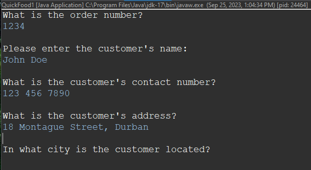
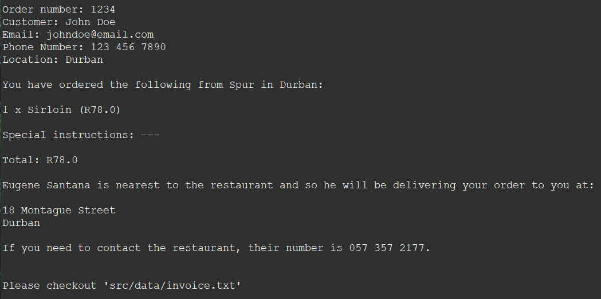

# Food Ordering Program Capstone

**Table of Contents**

- [Author](#author)
- [Introduction](#introduction)
- [Background](#background)
- [Logical Steps](#steps)
- [Application Usage](#usage)

## Author

<a href="https://github.com/HenriBranken" target="_blank">Henri Branken</a>

## Introduction

In this task we need to code a Food Delivery application for a company called **"Food Quick"**.
_FoodQuick_ receives customer orders and distributes them to drivers based on their current load and location. Put differently, the program needs to find a driver in the correct area with the smallest load, and assign the order to him. It goes without saying that the Driver, Customer & Restaurant need to be in the same area.

Not only must the program distribute orders accordingly, but it must also create and store an invoice after customer input has been captured.

## Background

This task requires the following skills:

- Writing code that is free from Runtime and Logical errors.
- Coding in the Object-Oriented Programming Paradigm (with Java).
- Careful, logical implementation of decision-making and logical structures.
- Class Creation, which include:
  - Restaurant Objects
  - Customer Objects
- Use of Defensive Programming, which consists of
  - IF Validation
  - Exception Handling

## Logical Steps

- Capture details that are used to create a new Customer Object
- Capture the details that are used to create a new Restaurant Object
- Ensure that the Customer and Restuarant are in the same City.
- Find a driver in the correct city with the smallest load, and assign the order to him.
- Create an invoice after all the customer input has been captured.

**Tip:** Have a look at **`FoodQuickFlowChart.pdf`** to inspect the logic behind the application.

## Application Usage

- Open up the main directory containing all the code in Eclipse, or your favourite Java IDE.
- Navigate to **`src/(default package)/QuickFood2.java`**.
- Double-click the Java program to open it up in the code editor space.
- Right-Click somewhere in the space of the code editor.
- Navigate to **`Run As > Java Application`**
- From the Console, further interact with the program by proving valid input to all the prompts.
- If the entire process is error-free, a text document called **`invoice.txt`** can be found at **`src/(default package)/invoice.txt`** at the end of the order-cycle.

